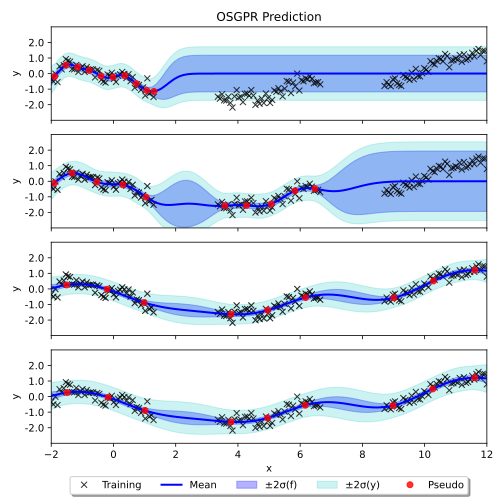

# Online Sparse Gaussian Process Regression

This repository contains a pure PyTorch implementation of an online sparse Gaussian process regression model proposed by [Bui et. al., NeurIPS 2017](https://proceedings.neurips.cc/paper/2017/hash/f31b20466ae89669f9741e047487eb37-Abstract.html).



## Installation

```
# Create a virtual environment
conda create -n osgpr python=3.8
conda activate osgpr

# Install PyTorch (2.1.0) from https://pytorch.org/get-started/locally/. For example,
conda install pytorch torchvision torchaudio pytorch-cuda=11.8 -c pytorch -c nvidia

# Install other dependencies
pip install matplotlib tqdm git+https://github.com/gngdb/pytorch-minimize.git
```

## Get Started

Simply run the `main.py` file to see an 1D demo:

```
python main.py
```

If you would like to compare the results with the [original GPflow implementation](https://github.com/thangbui/streaming_sparse_gp), install GPflow 2.6:

```
pip install gpflow==2.6
```

Run the `sanity_check.py` file to see the side-by-side comparison:

```
python sanity_check.py
```


